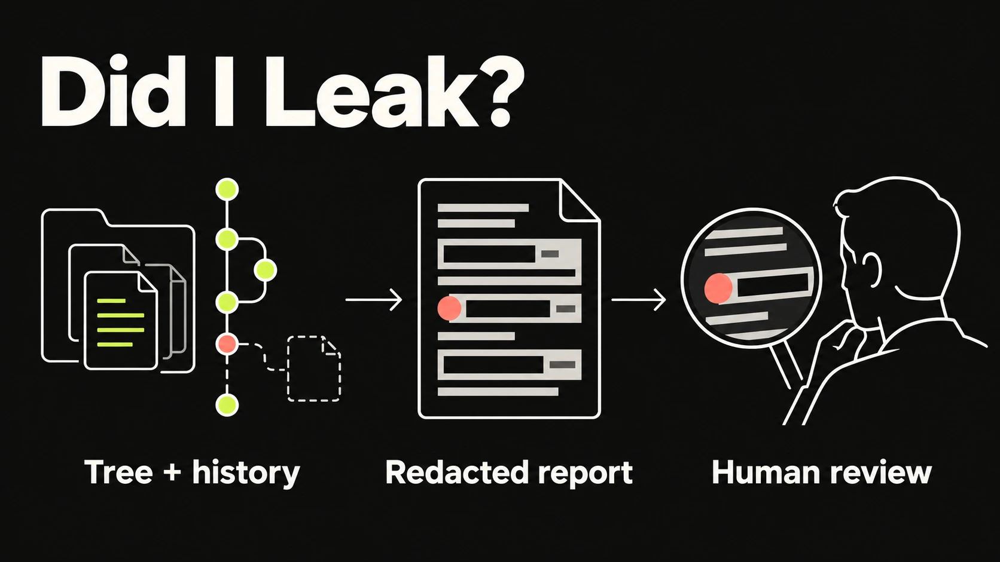

# Did I Leak?

**Before you make a repo public, check what Git remembers.**

Your `.env` is gone. Your Git history remembers.



[Website](https://pengusto.github.io/did-i-leak/) · [Preview asset and generation prompt](output/portfolio-handoff/README.md)

The report supports a human decision. It is not a security certificate and does not publish your repository.

`did-i-leak` is a small, local-first pre-publication check for developers, AI-assisted workflows, and open-source releases. It orchestrates established scanners instead of pretending to replace them, then turns the result into one useful verdict:

- `GO`
- `GO WITH REVIEW`
- `NO-GO`

It never prints full secrets and never changes credentials, Git history, refs, or repository visibility.

## Install and run

You need Python 3.9+ and Git. Clone into an unused directory:

```sh
git clone https://github.com/pengusto/did-i-leak.git
cd did-i-leak
./bin/did-i-leak --repo /path/to/target-repo --full
```

Replace `/path/to/target-repo` with the repository you want to inspect. The CLI defaults to the current working directory; running the next command from this checkout checks `did-i-leak` itself:

```sh
./bin/did-i-leak
```

Machine-readable output is safe to save or pipe:

```sh
./bin/did-i-leak --json
```

### Fast after the first scan

The first run checks the whole repository history. Later runs reuse safe local scan state and inspect what changed. Before a public launch, run a fresh full audit:

```sh
./bin/did-i-leak --full
```

The cache lives at `.git/did-i-leak/state.json`, is repository-local, and contains only validated metadata and redacted finding identifiers—not detected credential values. The working tree, staged changes, and relevant untracked files are checked on every run. A rewritten or uncertain history, changed scanner/detection configuration, corrupted cache, or incompatible cache schema falls back to a full audit.

Exit codes are `0` for `GO`, `1` for `GO WITH REVIEW`, `2` for `NO-GO`, and `3` when the repository cannot be inspected.

## Better coverage

Install these tools through your normal package manager or official release process. `did-i-leak` does not install them for you:

- [Gitleaks](https://github.com/gitleaks/gitleaks)
- [TruffleHog](https://github.com/trufflesecurity/trufflehog)

Both are invoked against the current tree and reachable Git history. TruffleHog verification is disabled by default so a local check does not send candidate credentials to external services.

Incremental scanner coverage follows each tool's native capabilities. Gitleaks receives a `git --log-opts` delta for newly reachable commits and always scans the current directory. TruffleHog uses `--since-commit`/`--branch` for one changed local branch; new or mixed branches, tags, detached history, or ambiguous coverage use a conservative full Git scan. Its filesystem scan still runs every time.

Without either scanner, the fallback still checks text in the current tree—including ignored `.env` files outside dependency/build directories—and historical blobs for credential-shaped values, private-key headers, JWTs, credential-bearing database URLs, PII, internal URLs, and absolute local paths. Missing or explicitly disabled scanners keep a clean result at `GO WITH REVIEW`.

## Agent skill

`SKILL.md` makes the same workflow available to Codex-compatible agents as `$did-i-leak`. The agent should preserve the redaction boundary, add context-aware judgment, and stop at `NO-GO` until blockers are handled.

## Example output

```text
DID I LEAK?

NO-GO

1 blocker

1. BLOCKER — Secret detected by Gitleaks
   File: scripts/test_api.py
   Commit: a83f2c1
   Status: deleted from current tree · Confidence: high
   Detectors: Gitleaks, TruffleHog
   Action: Revoke/rotate the credential before publishing.

Coverage
* Git history: 42 reachable commits · 3 branches · 2 tags
* Current tree: tracked, non-ignored, and ignored files outside dependency/build directories
* Gitleaks: completed
* TruffleHog: completed
```

## Website

The static landing page lives in `docs/`. GitHub Pages publishes `main` from `/docs`; no separate deployment workflow or build dependencies are needed. The README and website use the same approved explanation image in `docs/assets/`.

## Development

```sh
python3 -m unittest discover -s tests -v
./bin/did-i-leak --no-scanners
```

## License

MIT. See [LICENSE](LICENSE).
